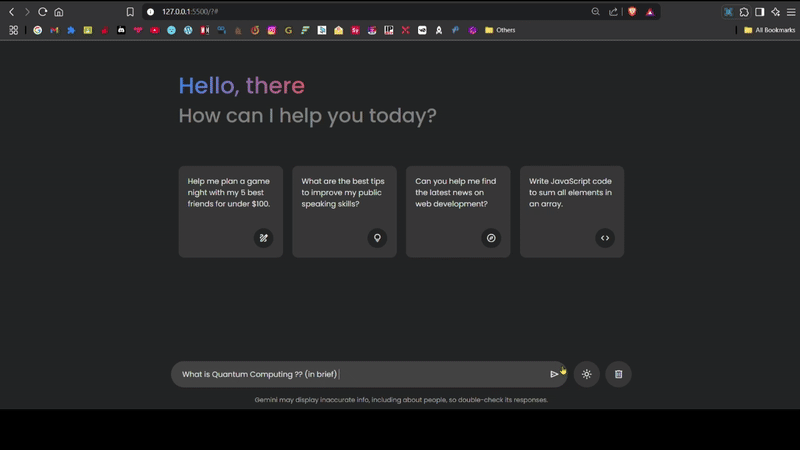

# Gemini Clone Project Setup

If you encounter an error like "API key not valid. Please pass a valid API key." while chatting with the Gemini, please follow these steps:

## Get Your API Key

1. Go to [Google AI Studio](https://aistudio.google.com/app/apikey).
2. Navigate to the API key section and create a new API key.

Your API key will look something like this:  
`AIzaSyAertghGX13bTmx0l_gewfnvY_wOTQ`

**Note:** The API is free but has a limited number of usage requests.

## Insert Your API Key

1. Open your project folder in VS Code.
2. Locate the `script.js` file in your project.
3. Find the `API_KEY` variable and replace `PASTE-YOUR-API-KEY` with your actual API key.

## Save and Test

1. Save the `script.js` file after adding your API key.
2. Open `index.html` in your browser to verify that Gemini is working correctly.

## 📸 Output / Results

  

## 🚀 Live Demo

🔗 **Working Link**:  [Try Here ...](https://g3m1n1.netlify.app/)

